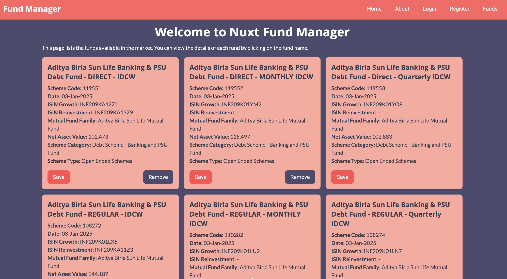
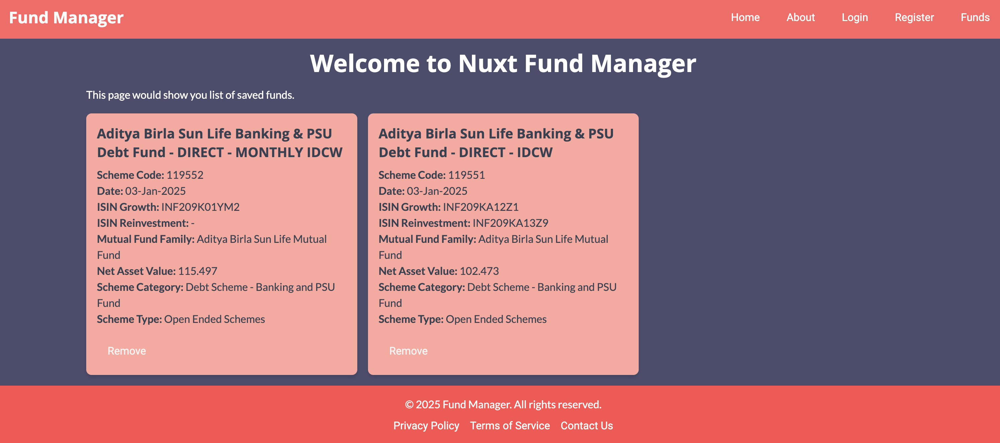

# Nuxt Portfolio Manager

This is a simple Portfolio Manager application which displays list of funds from this API 
`https://softgenie.com/api/funds`.

This application also provides option to save Fund in local storage. It does not involve any complex back-end but there are plans to add 
full-fledged back-end API with user management and authentication in future.

# Screenshots

# License

This project is licensed under the MIT License. See the [LICENSE](LICENSE) file for details.